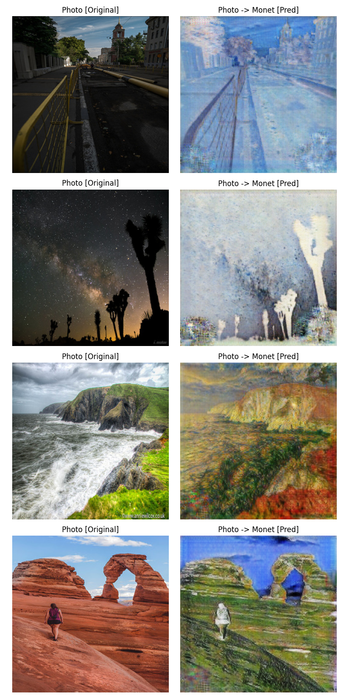

# Project Deeplearning: Transfer Style with Generative Adversarial Network


<a href="https://colab.research.google.com/drive/15LkSRibKqL_KBujqh2smK_1qQ7bC1pnf?usp=share_link" target="_blank">
  
</a>

---

## Teams:

- FOZAME ENDEZOUMOU Armand Bryan
- Clare Reine APPESI
- Ketsia TALOTSING
- Georges LIKOSSO
- Seth SADY

Prof: *Dr Yasser Almehio*

## Description of the Project

This project aims to familiarize ourselves with the **GAN (Generative Adversarial Network)** architecture by implementing an advanced GAN model. The objective is to prepare a dataset with two distinct styles and transfer one style onto real images.

Our professor suggested using a cartoon style and preparing the dataset with **OpenCV** and **Pix2Pix (Conditional GAN)**, but also left us the freedom to explore other techniques and models. Based on this flexibility, we decided to take a different approach.

### **Our Approach**
1. **Dataset Preparation**:
   - Instead of using OpenCV to generate stylized images (which produces relatively simple styles), we utilized a pre-existing dataset containing original images and artistic paintings: **Monet2Photo**.
   - OpenCV's simple algorithms are insufficient for generating complex styles. By leveraging GANs, we utilize their generalization power to generate intricate and high-quality styles that are difficult to reproduce with basic algorithms.

2. **Why CycleGAN?**
   - **Pix2Pix** requires paired datasets (e.g., "real cat photo | stylized cat photo"), which can be challenging to find or prepare. 
   - **CycleGAN**, on the other hand, is unpaired and extracts the style directly from the provided images without needing paired datasets, making it a more versatile option for this project.

We were inspired by the **original CycleGAN paper** and followed its architecture to implement our solution.

---

## Dataset: Monet2Photo

For this project, we used the **Monet2Photo dataset**. This dataset consists of photographs and paintings from Claude Monet's collection, enabling us to train the CycleGAN model to transfer Monet's artistic style onto real images.

---

## About Claude Monet

**Oscar-Claude Monet** (14 November 1840 – 5 December 1926) was a French painter and the founder of **Impressionism**, a style of painting that emphasizes the perception of nature as seen by the artist. Monet is considered a precursor to modernism for his focus on outdoor landscapes and light, capturing fleeting moments in nature. You can read more about Monet on *[Wikipedia](http://en.wikipedia.org/wiki/Claude_Monet)*.


---

## Installation

Clone the repository and install the required dependencies:
```bash
git clone https://github.com/Bryan-Foxy/style-transfer-gan.git
cd style-transfer-gan
```
**Checkpoints**

To test the model, you need to download the pre-trained checkpoints:
[Download Checkpoints](https://drive.google.com/file/d/1qG4SLK0QA43hKC94WuIDuf9kC_4mLaui/view?usp=sharing)

Install dependencies:
```python
pip install -r requirements.txt
```

## Dataset Visualization

To understand the behavior of the dataset, we applied t-SNE for dimensionality reduction and visualized the data in 2D.


## Implementation Details

We implemented the CycleGAN model from scratch using JAX and Flax, which are modern frameworks optimized for GPU acceleration and deep learning research. CycleGAN is a resource-intensive model, so we trained it on an A100 GPU provided by Google Colab.

**Training Configuration:**

	•	Batch Size: 4
	•	Epochs: 50
	•	Activation Function: ReLU
	•	Dataset Size: ~8000 images
	•	Training time: ~5 hours

	Note: In the original CycleGAN implementation, the batch size was 1, and training was conducted for 300 epochs.

**Training Progress**

During training, we monitored the adversarial loss and cycle-consistency loss. The training curve below shows the evolution of the losses, ensuring convergence of the model.


## Inference

We created two scripts for model inference: one for processing individual images and another for videos.

**Image Inference**
```python
python inference_image.py --model_path "PATH_TO_CHECKPOINT" --input_image "PATH_TO_IMAGE"
```

The results will be saved in the directory:
`results/outputs/`

**Video Inference**
```python
python inference_video.py --model_path "PATH_TO_CHECKPOINT" --input_video "PATH_TO_VIDEO"
```

This script processes the input video and generates stylized frames side-by-side for comparison.


## Results and Observations

CycleGAN successfully transferred Claude Monet’s style onto real-world images and videos, preserving their structure while adding artistic flair. Below are some highlights of the results:

	•	Image-to-Image Translation:
The generated images retained the structure of the original photos while seamlessly integrating Monet’s unique color palette and brushstroke patterns.
	•	Video Processing:
Our video inference script processes input videos frame-by-frame, applies the trained CycleGAN model, and combines the results side-by-side for visualization.



<video controls width="600">
       <source src="results/combined_video.mp4" type="video/mp4">
       Your browser does not support the video tag.
</video>

Acknowledgments

This project was inspired by the original CycleGAN paper:
Jun-Yan Zhu, Taesung Park, Phillip Isola, and Alexei A. Efros. “Unpaired Image-to-Image Translation using Cycle-Consistent Adversarial Networks.” ICCV 2017.

You can read the paper here.

Thank you for exploring our work! Let us know if you have any questions or feedback.

